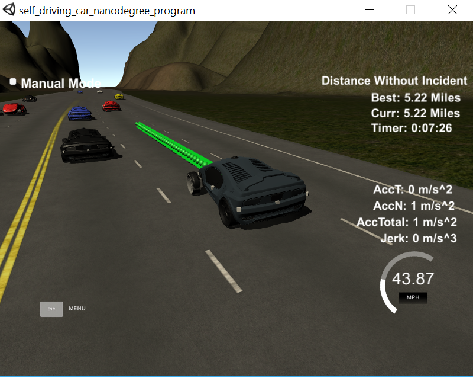
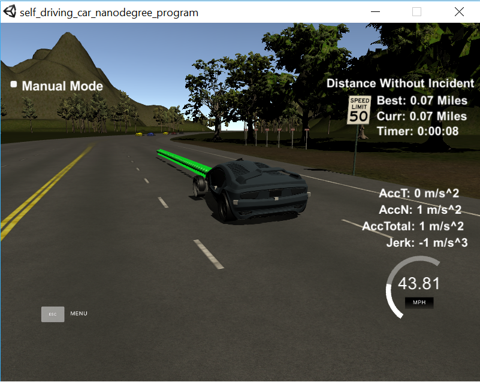
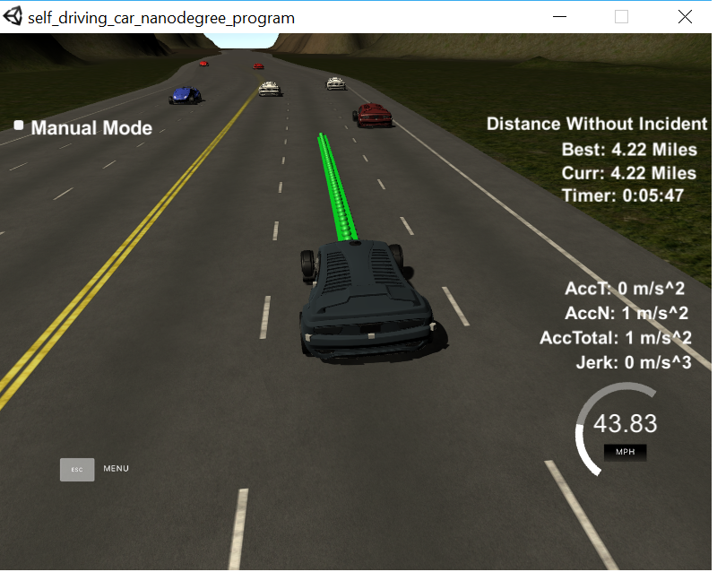
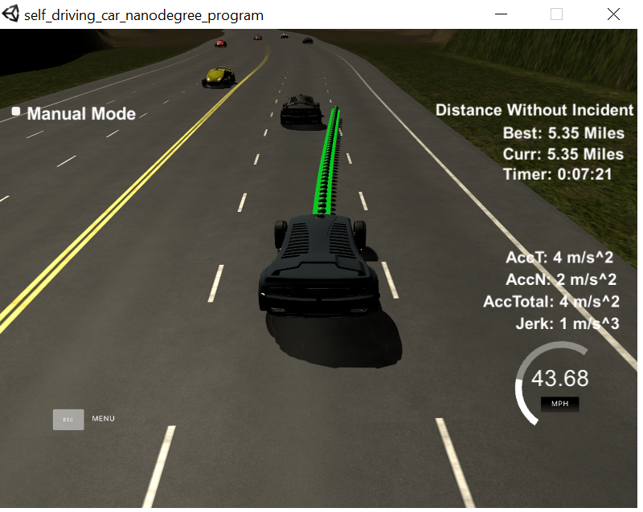

## The car is able to drive at least 4.32 miles without incident..

The top right screen of the simulator shows the current/best miles driven without incident. Incidents include exceeding acceleration/jerk/speed, collision, and driving outside of the lanes. Each incident case is also listed below in more detail.



i can run the simulation and without incidents for 5 miles.

## The car drives according to the speed limit.

The car doesn't drive faster than the speed limit. Also the car isn't driving much slower than speed limit unless obstructed by traffic.



i simple set the velocity under 50, and set it to the limit  if i surpass the limit

```
//  dont let velocity > limit
				if ( ref_vel > speed ) {
					ref_vel = speed;
				}  	
```

## Max Acceleration and Jerk are not Exceeded.

The car does not exceed a total acceleration of 10 m/s^2 and a jerk of 10 m/s^3.

i simply accelearte very slowy.

```
double acc = .25;
```

## Car does not have collisions.

The car must not come into contact with any of the other cars on the road.

i simply set the car s to te end path in order to avoid collisions.

```
       if (prev_size > 0) {
              car_s = end_path_s;
            }
```

I also check if there are cars in the left or the right in order to avoid collisions.


## The car stays in its lane, except for the time between changing lanes.

The car doesn't spend more than a 3 second length out side the lane lanes during changing lanes, and every other time the car stays inside one of the 3 lanes on the right hand side of the road.

the car will stay in lane same lane.



if you have a car infront of you going more slowly than you, the car will change lane, if the car can go both lanes i use a random.




i check if there are cars in the left or rigth, or in the front, if there is not cars, i change lanes. I also check de distance between the car and the others cars.

```
				if(position_other_car!=-100 && abs(car_s - new_other_car_s)<27   ){ // we have a car in some lane and near the car?
					if ( position_other_car == -1 ) { // we have a car in the left
						L = true;
					} else if ((new_other_car_s >= car_s) && position_other_car == 0  ) { // we have a car in the same lane
						F = true;
					} else if (position_other_car == 1 ){ // we have a car in the right
						R = true;
					}
				}nsole.log("notice the blank line before this function?");
}
```

## The car is able to change lanes

The car is able to smoothly change lanes when it makes sense to do so, such as when behind a slower moving car and an adjacent lane is clear of other traffic.


if the car has to chage lanes, i use the sline to calculate the points in the future and then chage the rest of the points.

```
 for ( int i = 1; i < 4; i++ ) {
				vector<double> xy = getXY(car_s + i*30, (2 + 4*lane), map_waypoints_s, map_waypoints_x, map_waypoints_y);    
 				points_x.push_back(xy[0]);
				points_y.push_back(xy[1]);
}
			// t
```
then i use those point with the sline to generate the rest of the points

```
  sline.set_points(points_x, points_y);
```
then i generate the rest of the points

```
  double target_y = sline(target_x);
            double target_dist = sqrt(target_x*target_x + target_y*target_y);
			// generate 50 poins in the future
            for( int i = 1; i < 50 - prev_size; i++ ) {
				// add the velocity deifference
				ref_vel += diff_v;
				//  dont let velocity > limit
				if ( ref_vel > speed ) {
					ref_vel = speed;
				}  			    	
				// increment
				double new_shift_x = old_shift_x + target_x/(target_dist/(0.008*ref_vel));
				double new_shift_y = sline(new_shift_x);
				// save increment
				old_shift_x = new_shift_x;
				// calculate positon
				next_x_vals.push_back(new_shift_x * cos(1*ref_yaw) - new_shift_y * sin(1*ref_yaw) + original_position_x);
				next_y_vals.push_back(new_shift_x * sin(1*ref_yaw) + new_shift_y * cos(1*ref_yaw) + original_position_y);
            }


```
